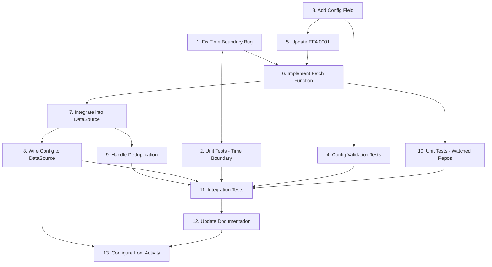

# Watched Repos Feature Implementation

## Context

**Bug discovered**: Time boundary mismatch in GitHub datasource causes PRs to be incorrectly filtered. GitHub search uses date granularity (`updated:>=2025-12-08`), but Go code uses timestamp comparison (`!item.UpdatedAt.After(since)`). PRs updated on the same day but before the exact `since` time are excluded.

**Feature gap**: No way to track merged PRs in repos the user cares about unless they are author/reviewer/mentioned.

**Solution**: Fix time boundary bug first, then add `watched_repos` config option with new fetch function to track merged PRs in watched repositories using the existing `pr_closed` event type.

## Tasks

### 1. Fix Time Boundary Bug (`golang-pro`)
Fix the timestamp comparison logic to correctly handle GitHub search's date granularity.

**Problem**: GitHub search uses `updated:>=2025-12-08` (date only), but post-filter uses `!item.UpdatedAt.After(since)` (timestamp). Items on boundary date but before exact `since` time are incorrectly filtered out.

**Files**: `internal/datasources/github/graphql_fetcher.go`

**Changes**:
- Line 53: Change `!item.UpdatedAt.After(since)` to `item.UpdatedAt.Before(since)`
- Line 152: Same fix in `fetchPRMentionsGraphQL`
- Line 217: Same fix in `fetchIssueMentionsGraphQL`
- Line 281: Same fix in `fetchAssignedIssuesGraphQL`
- Line 395: Same fix in `fetchAuthoredPRsGraphQL`
- Line 534: Same fix in `fetchClosedPRsGraphQL`
- Line 669: Same fix in `fetchPRCommentMentionsGraphQL`
- Add comment explaining GitHub search date boundary behavior

**Acceptance**:
- All existing tests pass without modification
- PRs updated on same date as `since` but before exact time are no longer filtered out
- PRs exactly at `since` timestamp are included (correct `>=` semantics)
- No behavioral change for items genuinely before `since` timestamp

---

### 2. Unit Tests for Time Boundary Fix (`test-automator`)
Test that boundary fix correctly includes same-day items.

**Depends on**: Task 1

**Files**: `internal/datasources/github/graphql_fetcher_test.go`

**Test cases**:
```go
func TestFetchPRReviewRequests_TimeBoundary(t *testing.T) {
    since := time.Date(2025, 12, 8, 10, 0, 0, 0, time.UTC)
    tests := []struct {
        name         string
        updatedAt    time.Time
        wantIncluded bool
    }{
        {"exactly at since", since, true},
        {"1 second before since", since.Add(-time.Second), false},
        {"1 second after since", since.Add(time.Second), true},
        {"1 hour before since, same day", since.Add(-time.Hour), false},
        {"1 hour after since, same day", since.Add(time.Hour), true},
    }
    // ...
}
```

**Acceptance**:
- All 5 test cases pass
- Tests use table-driven format
- Mock GraphQL responses with specific `updatedAt` values
- Tests verify items are included/excluded correctly

---

### 3. Add `watched_repos` Config Field (`golang-pro`)
Add configuration option for watched repositories.

**Files**: `internal/config/config.go`

**Changes**:
```go
type GitHubConfig struct {
    Enabled bool     `yaml:"enabled"`
    Orgs    []string `yaml:"orgs,omitempty"`

    // WatchedRepos tracks merged PRs in these repos regardless of user involvement.
    // Format: "owner/repo" (e.g., "kubernetes/kubernetes")
    // Limit: 50 repos maximum to prevent API abuse
    WatchedRepos []string `yaml:"watched_repos,omitempty"`
}
```

**Validation** (in `Validate()` method):
- Each entry must match pattern: `^[a-zA-Z0-9_.-]+/[a-zA-Z0-9_.-]+$`
- No duplicate repos
- Maximum 50 repos
- Return clear error messages

**Acceptance**:
- Config field added with YAML tag
- Validation rejects invalid formats with descriptive errors
- Validation rejects duplicates
- Validation rejects > 50 repos
- Empty list is valid (optional feature)
- Existing configs without field load successfully

---

### 4. Config Validation Tests (`test-automator`)
Test watched_repos config validation.

**Depends on**: Task 3

**Files**: `internal/config/config_test.go` (create if doesn't exist)

**Test cases**:
```go
func TestGitHubConfig_Validate_WatchedRepos(t *testing.T) {
    tests := []struct {
        name        string
        watchedRepos []string
        wantErr     bool
        errContains string
    }{
        {"valid single repo", []string{"owner/repo"}, false, ""},
        {"valid multiple repos", []string{"owner/repo", "org/project"}, false, ""},
        {"empty list", []string{}, false, ""},
        {"nil list", nil, false, ""},
        {"invalid no slash", []string{"invalid"}, true, "format"},
        {"invalid spaces", []string{"owner/repo name"}, true, "format"},
        {"duplicates", []string{"owner/repo", "owner/repo"}, true, "duplicate"},
        {"exceeds limit", make51Repos(), true, "maximum 50"},
    }
    // ...
}
```

**Acceptance**:
- All 8 test cases pass
- Table-driven test format
- Error messages verified
- Helper function `make51Repos()` generates test data

---

### 5. Update EFA 0001 with `watched_repo` Metadata (`documentation-engineer`)
Document the `watched_repo` metadata key in EFA 0001.

**Depends on**: Task 3 (config design finalized)

**Files**: `specs/efas/0001-event-model.md`

**Changes**:

1. Add to GitHub PR Metadata table (line ~230):
```markdown
| `watched_repo` | bool | Whether this PR is from a watched repo (user not directly involved) |
```

2. Add to `allowedMetadataKeys[SourceGitHub]` map (line ~336):
```go
"watched_repo": {},
```

3. Update user_relationships documentation to note watched repos use empty array:
```markdown
For watched repo PRs where user has no direct involvement, `user_relationships` is an empty array `[]`.
```

4. Add example event (after line 753):
```json
{
  "type": "pr_closed",
  "title": "Merged in kubernetes/kubernetes: Add pod security",
  "source": "github",
  "url": "https://github.com/kubernetes/kubernetes/pull/12345",
  "author": {
    "name": "External Contributor",
    "username": "external-dev"
  },
  "timestamp": "2025-12-08T10:30:00Z",
  "priority": 5,
  "requires_action": false,
  "metadata": {
    "repo": "kubernetes/kubernetes",
    "number": 12345,
    "state": "merged",
    "author_login": "external-dev",
    "user_relationships": [],
    "watched_repo": true,
    "merged_at": "2025-12-08T10:30:00Z",
    "merged_by": "maintainer",
    "files_changed_count": 3,
    "ci_rollup": "success"
  }
}
```

**Acceptance**:
- Metadata key documented in table with type and description
- Key added to `allowedMetadataKeys` code block
- Example event shows correct structure
- No breaking changes to existing definitions
- Markdown renders correctly (table formatting valid)

---

### 6. Implement `fetchWatchedRepoMergedPRs` Function (`golang-pro`)
Create fetch function for watched repository PRs.

**Depends on**: Task 1 (time boundary fix), Task 5 (EFA update)

**Files**: `internal/datasources/github/graphql_fetcher.go`

**Implementation**:
```go
// fetchWatchedRepoMergedPRs fetches recently merged PRs from watched repositories.
// Query per repo: is:pr is:merged repo:OWNER/REPO merged:>=TIMESTAMP
//
// Per EFA 0001:
//   - EventType: models.EventTypePRClosed (reuses existing type)
//   - Priority: models.PriorityInfo (5) - informational awareness
//   - RequiresAction: false
//   - Metadata: includes watched_repo: true
//   - user_relationships: [] (empty - user not involved)
//
// Per EFA 0003: Context must be used for all network operations.
func (d *DataSource) fetchWatchedRepoMergedPRs(
    ctx context.Context,
    client *GraphQLClient,
    since time.Time,
    watchedRepos []string,
) ([]models.Event, error) {
    // Implementation:
    // 1. For each repo in watchedRepos:
    //    a. Build query: is:pr is:merged repo:OWNER/REPO merged:>=TIMESTAMP
    //    b. Use since.Format(time.RFC3339) for timestamp
    //    c. Search with limit=20 per repo
    //    d. Check context cancellation between repos
    // 2. For each search result:
    //    a. Check item.UpdatedAt.Before(since) to filter
    //    b. Fetch full PR context via fetchPRFullContext
    //    c. Set watched_repo: true in metadata
    //    d. Set user_relationships: []
    //    e. Use state-based title: "Merged in REPO:" or "Closed in REPO:"
    // 3. Return all events, accumulate errors for partial success
}
```

**Search strategy**:
- Use `is:pr is:merged repo:owner/repo merged:>=TIMESTAMP` per repo
- Limit 20 results per repo to bound API usage
- Use `merged:>=` (not `updated:>=`) for accurate filtering
- Format timestamp with RFC3339 for precision

**Title format**:
- Merged: `"Merged in OWNER/REPO: PR_TITLE"`
- Closed without merge: `"Closed in OWNER/REPO: PR_TITLE"`

**Acceptance**:
- Function signature matches specification
- Search uses `merged:>=` with RFC3339 timestamp
- Limit 20 results per repo
- Context cancellation checked between repos
- Partial success: one repo error doesn't stop others
- Metadata includes `watched_repo: true`
- Metadata includes `user_relationships: []` (empty array)
- Priority is `PriorityInfo` (5)
- RequiresAction is `false`
- Events pass `Event.Validate()`
- Title distinguishes merged vs closed

---

### 7. Integrate Watched Repos into DataSource (`golang-pro`)
Wire watched repos fetch into main DataSource.Fetch() method.

**Depends on**: Task 6

**Files**:
- `internal/datasources/github/datasource.go`

**Changes**:

1. Add field to DataSource struct (after line 41):
```go
type DataSource struct {
    authProvider auth.AuthProvider
    orgs         []string
    watchedRepos []string  // NEW: repos to track merges in

    codeownersFetcher *codeowners.Fetcher
    teamResolver      *codeowners.TeamResolver
    currentUser       string
    currentUserOnce   sync.Once
    currentUserErr    error
}
```

2. Add functional option (after line 80):
```go
// WithWatchedRepos configures repos to track merged PRs in.
// PRs are tracked regardless of user involvement for awareness of activity.
func WithWatchedRepos(repos []string) Option {
    return func(d *DataSource) {
        d.watchedRepos = repos
    }
}
```

3. Add fetch call in Fetch() method (after line 271, before deduplication):
```go
// 8. Watched repo merged PRs (optional awareness)
if len(d.watchedRepos) > 0 {
    watchedMerges, err := d.fetchWatchedRepoMergedPRs(ctx, gqlClient, opts.Since, d.watchedRepos)
    if err != nil {
        fetchErrors = append(fetchErrors, fmt.Errorf("watched repos: %w", err))
    } else {
        allEvents = append(allEvents, watchedMerges...)
        result.Stats.APICallCount++
    }
}

// Check context before deduplication
if ctx.Err() != nil {
    result.Events = allEvents
    result.Errors = fetchErrors
    result.Partial = len(allEvents) > 0
    result.Stats.Duration = time.Since(startTime)
    return result, ctx.Err()
}
```

**Acceptance**:
- `watchedRepos` field added to struct
- `WithWatchedRepos` option created
- Fetch only runs when `len(d.watchedRepos) > 0`
- Errors don't fail entire fetch (partial success)
- Events included in deduplication at line 275
- Stats updated correctly

---

### 8. Wire Config to DataSource Creation (`golang-pro`)
Pass watched repos from config to datasource.

**Depends on**: Task 7

**Files**: Find where GitHub datasource is created (likely `cmd/kora/digest.go` or main command file)

**Changes**:
```go
// When creating GitHub datasource
opts := []github.Option{
    github.WithOrgs(cfg.Datasources.GitHub.Orgs),
}

if len(cfg.Datasources.GitHub.WatchedRepos) > 0 {
    opts = append(opts, github.WithWatchedRepos(cfg.Datasources.GitHub.WatchedRepos))
}

githubDS, err := github.NewDataSource(githubAuth, opts...)
```

**Acceptance**:
- Config value flows to datasource
- Empty config doesn't pass empty slice (skips option)
- Multiple options combine correctly
- Datasource receives watched repos list

---

### 9. Handle Deduplication of Watched Repo PRs (`golang-pro`)
Ensure deduplication correctly merges user's PR with watched repo PR.

**Depends on**: Task 7

**Files**: `internal/models/deduplicate.go` (if exists, else `internal/datasources/github/datasource.go`)

**Analysis**:
- Current deduplication at line 275: `allEvents = models.DeduplicateEvents(allEvents)`
- User's authored PR (Priority 1-3) vs watched repo PR (Priority 5)
- Higher priority should win when same URL
- `watched_repo: true` should be removed if user is author

**Changes** (if needed):
- Verify `DeduplicateEvents` preserves higher-priority event
- Verify metadata from higher-priority event is kept
- Add logic to remove `watched_repo: true` if `user_relationships` contains "author"

**Test case to verify**:
```go
// Scenario: User's PR #123 in watched repo kubernetes/kubernetes
// Event 1: pr_author, Priority 3, user_relationships: ["author"], watched_repo: false
// Event 2: pr_closed, Priority 5, user_relationships: [], watched_repo: true
// Expected: Event 1 wins, no watched_repo metadata
```

**Acceptance**:
- User's authored PR appears once with correct priority (not 5)
- `watched_repo: true` not present when user is author
- `user_relationships` contains "author" (not empty)
- Deduplication test covers this scenario

---

### 10. Unit Tests for Watched Repos Fetch (`test-automator`)
Test `fetchWatchedRepoMergedPRs` in isolation.

**Depends on**: Task 6

**Files**: `internal/datasources/github/graphql_fetcher_test.go`

**Test cases**:
```go
func TestFetchWatchedRepoMergedPRs(t *testing.T) {
    tests := []struct {
        name          string
        watchedRepos  []string
        mockResponses map[string]string
        wantEvents    int
        wantErrors    int
    }{
        {
            name:         "single repo with merged PRs",
            watchedRepos: []string{"owner/repo"},
            mockResponses: map[string]string{
                "search_owner_repo": "testdata/watched_repo_merged_prs.json",
            },
            wantEvents: 3,
            wantErrors: 0,
        },
        {
            name:         "multiple repos",
            watchedRepos: []string{"owner/repo1", "owner/repo2"},
            mockResponses: map[string]string{
                "search_owner_repo1": "testdata/repo1_merges.json",
                "search_owner_repo2": "testdata/repo2_merges.json",
            },
            wantEvents: 5,
            wantErrors: 0,
        },
        {
            name:         "no merged PRs in window",
            watchedRepos: []string{"owner/repo"},
            mockResponses: map[string]string{
                "search_owner_repo": "testdata/empty_search.json",
            },
            wantEvents: 0,
            wantErrors: 0,
        },
        {
            name:         "partial failure - one repo errors",
            watchedRepos: []string{"owner/good", "owner/bad"},
            mockResponses: map[string]string{
                "search_owner_good": "testdata/good_merges.json",
                "search_owner_bad":  "ERROR:500",
            },
            wantEvents: 2,
            wantErrors: 1,
        },
        {
            name:         "empty watched repos",
            watchedRepos: []string{},
            mockResponses: map[string]string{},
            wantEvents: 0,
            wantErrors: 0,
        },
    }

    for _, tt := range tests {
        t.Run(tt.name, func(t *testing.T) {
            // Setup mock client
            // Execute fetch
            // Verify event count
            // Verify error count
            // Verify metadata fields:
            //   - watched_repo: true
            //   - user_relationships: []
            //   - priority: 5
            //   - requires_action: false
        })
    }
}
```

**Metadata verification**:
```go
func TestWatchedRepoPRMetadata(t *testing.T) {
    // Test that all watched repo events have:
    // 1. watched_repo: true
    // 2. user_relationships: [] (empty)
    // 3. Priority: 5 (Info)
    // 4. RequiresAction: false
    // 5. Type: EventTypePRClosed
    // 6. Pass Event.Validate()
}
```

**Acceptance**:
- All test cases pass
- Mock GraphQL responses in testdata/
- Tests verify metadata structure per EFA 0001
- Tests verify partial success behavior
- Tests verify context cancellation
- Tests verify title format (Merged/Closed prefix)

---

### 11. Integration Tests for Watched Repos (`test-automator`)
Test watched repos in full fetch cycle with deduplication.

**Depends on**: Task 9 (deduplication logic)

**Files**: `internal/datasources/github/datasource_test.go`

**Test cases**:
```go
func TestDataSource_Fetch_WatchedRepos(t *testing.T) {
    tests := []struct {
        name             string
        watchedRepos     []string
        mockAuthored     bool  // mock user authored PR
        mockWatched      bool  // mock same PR in watched repo
        wantEventCount   int
        wantWatchedCount int  // events with watched_repo: true
    }{
        {
            name:             "watched repo only",
            watchedRepos:     []string{"owner/repo"},
            mockAuthored:     false,
            mockWatched:      true,
            wantEventCount:   2,
            wantWatchedCount: 2,
        },
        {
            name:             "user authored PR in watched repo - deduplicated",
            watchedRepos:     []string{"owner/repo"},
            mockAuthored:     true,  // user authored PR #123
            mockWatched:      true,  // same PR #123 in watched repo
            wantEventCount:   1,     // deduplicated to 1 event
            wantWatchedCount: 0,     // watched_repo: false (user is author)
        },
        {
            name:             "no watched repos configured",
            watchedRepos:     []string{},
            mockAuthored:     true,
            mockWatched:      false,
            wantEventCount:   1,
            wantWatchedCount: 0,
        },
    }

    for _, tt := range tests {
        t.Run(tt.name, func(t *testing.T) {
            // Setup datasource with watched repos
            // Mock responses for authored PRs and watched repos
            // Execute Fetch()
            // Verify event count
            // Verify watched_repo metadata
            // Verify deduplication behavior
        })
    }
}
```

**Deduplication test**:
```go
func TestWatchedRepoDeduplication(t *testing.T) {
    // Scenario: PR #123 in owner/repo
    // - User authored (pr_author, Priority 3, user_relationships: ["author"])
    // - Same PR in watched repo (pr_closed, Priority 5, user_relationships: [], watched_repo: true)
    // Expected: Single event with Priority 3, user_relationships: ["author"], no watched_repo field
}
```

**Acceptance**:
- All integration tests pass
- Deduplication correctly handles user's PR in watched repo
- Deduplication preserves higher priority
- watched_repo metadata correct in all scenarios
- Empty watched repos doesn't trigger fetch

---

### 12. Update User Documentation (`documentation-engineer`)
Document watched_repos feature for users.

**Depends on**: All implementation tasks complete

**Files**:
- `README.md`
- Create `docs/configuration.md` if doesn't exist

**README.md changes**:
Add to configuration example:
```yaml
datasources:
  github:
    enabled: true
    orgs: ["myorg"]
    # Track merged PRs in repos you watch but don't contribute to
    watched_repos:
      - "kubernetes/kubernetes"
      - "golang/go"
```

**docs/configuration.md content**:
```markdown
## Watched Repositories

Track merged PRs in repositories you care about, even if you're not directly involved.

### Use Cases
- Stay aware of activity in important upstream dependencies
- Monitor competitor or reference implementations
- Track community projects relevant to your work

### Configuration
```yaml
datasources:
  github:
    watched_repos:
      - "owner/repository"
```

### Behavior
- Events appear with Priority 5 (Info) - lowest priority
- Title format: "Merged in owner/repo: PR title"
- Only merged PRs are tracked (not opened or closed without merge)
- Limit: 50 repositories maximum
- If you author a PR in a watched repo, it appears once as your PR (not as watched)

### Example
```yaml
datasources:
  github:
    watched_repos:
      - "kubernetes/kubernetes"  # Track k8s core changes
      - "golang/go"              # Track Go language updates
```
```

**Acceptance**:
- README shows watched_repos in config example
- Configuration guide explains use cases
- Configuration guide documents behavior clearly
- Examples use real, well-known repos
- Limit documented (50 repos)
- Deduplication behavior explained

---

## Task Dependencies



## Risk Assessment

| Risk | Impact | Probability | Mitigation |
|------|--------|-------------|------------|
| Time boundary fix breaks existing fetches | High | Low | Comprehensive tests for all fetch methods |
| Watched repos cause API rate limiting | Medium | Medium | Limit 50 repos, 20 results per repo, context timeout |
| Deduplication doesn't handle edge cases | High | Low | Explicit test for user's PR in watched repo |
| Config validation too strict | Low | Medium | Allow empty list, validate format only |
| Watched repo events pollute digest | Low | Low | Priority 5 ensures they appear last |
| Search query syntax incorrect | High | Low | Test query format, verify GitHub API docs |

## Success Criteria

### All tasks complete when:
- [ ] `make test` passes with no failures
- [ ] `make lint` passes with no warnings
- [ ] `make security-scan` finds no new HIGH/CRITICAL issues
- [ ] Time boundary bug fixed (verified by tests)
- [ ] Watched repos config loads and validates correctly
- [ ] Watched repo PRs appear in digest with correct metadata
- [ ] User's own PRs are not duplicated with watched repo events
- [ ] All events pass EFA 0001 validation
- [ ] Test coverage >80% for new code
- [ ] Documentation clear and accurate

### Manual verification:
```bash
# Build
make build

# Create test config
cat > ~/.kora/config.yaml << 'EOF'
datasources:
  github:
    enabled: true
    watched_repos:
      - "kubernetes/kubernetes"
      - "golang/go"
EOF

# Run digest
./bin/kora digest --since 24h --format json | \
  jq '.events[] | select(.metadata.watched_repo == true) | {title, priority, repo: .metadata.repo}'

# Expected output: Merged PRs from k8s and Go with priority 5
```

---

### 13. Configure Watched Repos from GitHub Activity (`golang-pro`)
Analyze user's GitHub activity over the last month to populate `watched_repos` config.

**Depends on**: Task 8 (feature working end-to-end)

**Analysis approach**:
```bash
# Repos where user reviewed PRs (not authored)
gh api graphql -f query='
  query {
    search(query: "reviewed-by:@me -author:@me type:pr created:>=2025-11-08", type: ISSUE, first: 100) {
      nodes { ... on PullRequest { repository { nameWithOwner } } }
    }
  }
' | jq -r '.data.search.nodes[].repository.nameWithOwner' | sort | uniq -c | sort -rn

# Repos where user commented (not authored)
gh api graphql -f query='
  query {
    search(query: "commenter:@me -author:@me type:pr created:>=2025-11-08", type: ISSUE, first: 100) {
      nodes { ... on PullRequest { repository { nameWithOwner } } }
    }
  }
' | jq -r '.data.search.nodes[].repository.nameWithOwner' | sort | uniq -c | sort -rn
```

**Selection criteria**:
- Repos with 3+ interactions in last month
- Exclude repos where user is already author of PRs (already tracked)
- Exclude user's personal repos
- Prioritize org repos (chainguard-dev/*)

**Update config**:
```yaml
datasources:
  github:
    enabled: true
    watched_repos:
      # Populated from activity analysis
      - chainguard-dev/ecosystems-rebuilder.js
      - chainguard-dev/ecosystems-java-rebuilder
      # ... other high-activity repos
```

**Acceptance**:
- Analysis script runs successfully
- Config updated with repos matching criteria
- `kora digest --since 24h` shows watched repo events
- No duplicates with user's authored PRs
- Verify feature works end-to-end with real data

---

## Definition of Done

Feature is complete when:
1. All 13 tasks have passing acceptance criteria
2. Time boundary bug is fixed and tested
3. Watched repos config field implemented and validated
4. EFA 0001 updated with new metadata key
5. Fetch function implemented and tested (unit + integration)
6. Deduplication handles user's PR in watched repo
7. Config wired to datasource creation
8. Documentation updated
9. All tests pass (unit + integration)
10. No new lint or security issues
11. Manual verification successful
12. User's config populated with watched repos from activity analysis
